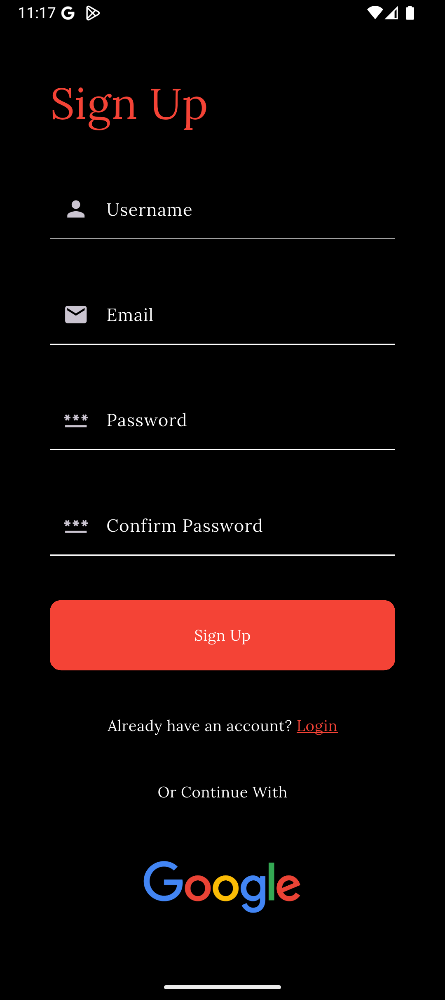
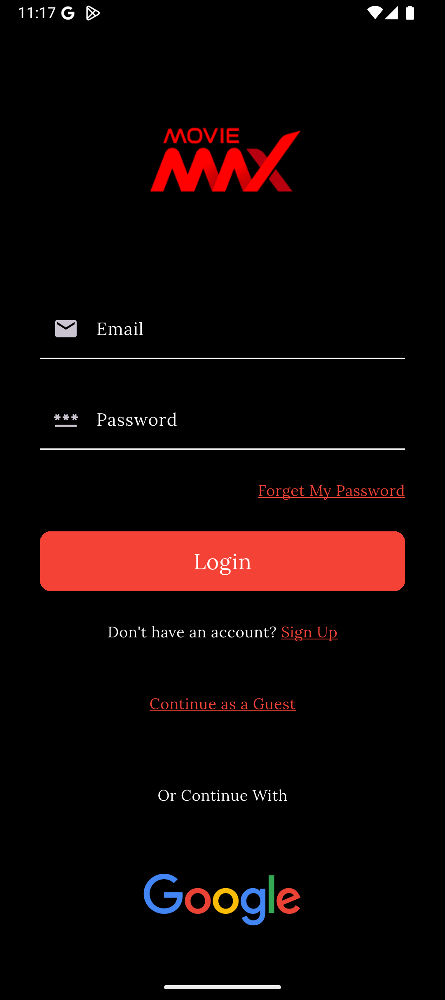
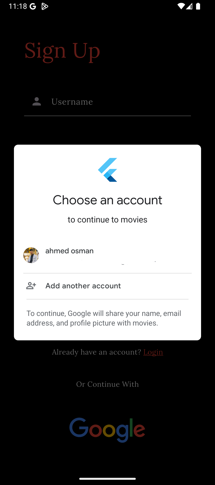
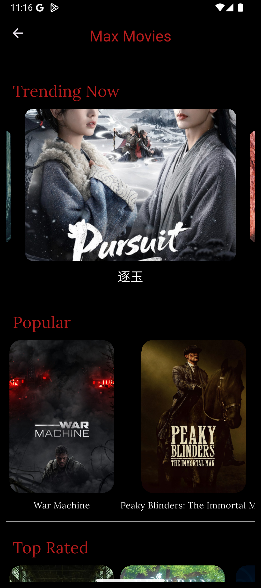

# Max Movies

A Flutter movie discovery app powered by the TMDB API and Firebase, featuring authentication, real-time connectivity monitoring, and a sleek dark-themed UI.

---

## Screenshots

<p align="center">
  
  
  
  
  
</p>

---

## Features

- **Authentication** — Email/password login & signup, Google Sign-In, and guest access via Firebase Auth
- **Movie Categories** — Browse Trending, Popular, Top Rated, Upcoming, and Discover sections
- **Movie Details** — Full detail view for each movie
- **Connectivity Monitoring** — Detects offline state and shows a no-internet screen automatically
- **Persistent Session** — Remembers login state across app restarts using SharedPreferences
- **Dark Theme** — Fully dark UI with custom fonts (Lora, Garamond, Kalam)

---

## Tech Stack

| Layer | Technology |
|---|---|
| Framework | Flutter (Dart) |
| State Management | GetX |
| Backend / Auth | Firebase Auth, Cloud Firestore |
| Movie Data | TMDB API |
| Networking | `http`, `cached_network_image` |
| Storage | SharedPreferences |
| Connectivity | connectivity_plus |
| UI | carousel_slider, flutter_spinkit, fluttertoast |

---

## Getting Started

### Prerequisites

- Flutter SDK `>=3.0.0`
- A [TMDB API key](https://www.themoviedb.org/settings/api)
- A Firebase project with Auth and Firestore enabled

### Setup

1. **Clone the repo**
   ```bash
   git clone https://github.com/your-username/movies.git
   cd movies
   ```

2. **Install dependencies**
   ```bash
   flutter pub get
   ```

3. **Configure Firebase**
   - Add your `google-services.json` (Android) and `GoogleService-Info.plist` (iOS) to the respective platform folders
   - Update `lib/firebase_options.dart` with your Firebase project settings

4. **Run the app**
   ```bash
   flutter run
   ```

---

## Project Structure

```
lib/
├── controllers/         # GetX controllers (auth, home, connectivity)
├── core/
│   ├── constants/       # API keys and endpoint URLs
│   ├── utils/           # Screen size helpers
│   └── widgets/         # Reusable widgets
├── models/              # Movie data model
└── views/
    ├── auth/            # Login & signup screens
    ├── home/            # Home screen with movie sections
    ├── movie_details/   # Movie detail screen
    ├── no_internet/     # Offline screen
    └── splash/          # Splash screen
```

---

## Author

Made with love by [Ahmed Osman](https://github.com/AhmedOsmanOmer)

---

## License

This project is for educational purposes only. Movie data is provided by [TMDB](https://www.themoviedb.org/).
