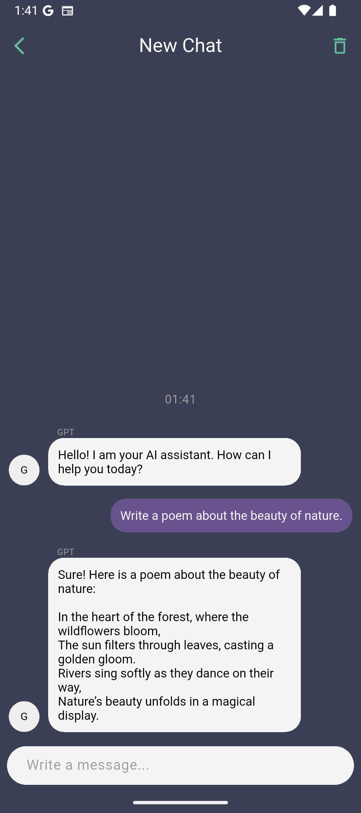
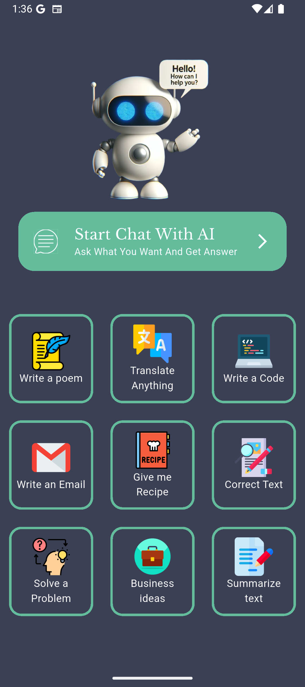

# 🤖 GPT Chat — AI Assistant App

A Flutter mobile application that brings the power of AI directly to your fingertips. Chat with an intelligent assistant, get creative content, translations, code, and much more — all in a clean and modern UI.

---

## 📸 Screenshots

<p float="left">
  
  &nbsp;&nbsp;&nbsp;
  
</p>

---

## ✨ Features

- 💬 **AI Chat** — Have a real-time conversation with an AI assistant powered by ChatGPT
- ✍️ **Write a Poem** — Generate creative poems on any topic
- 🌐 **Translate Anything** — Instantly translate text to any language
- 💻 **Write a Code** — Get code snippets and programming help
- 📧 **Write an Email** — Draft professional emails in seconds
- 🍳 **Give me a Recipe** — Get cooking recipes based on your ingredients
- ✅ **Correct Text** — Fix grammar and spelling mistakes
- 🧠 **Solve a Problem** — Get help thinking through any challenge
- 💡 **Business Ideas** — Brainstorm startup and business concepts
- 📄 **Summarize Text** — Condense long content into key points

---

## 🛠️ Built With

- [Flutter](https://flutter.dev/) — Cross-platform mobile framework
- [Dart](https://dart.dev/) — Programming language
- [OpenAI API](https://platform.openai.com/) — AI responses powered by ChatGPT

---

## 🚀 Getting Started


### Configuration

Add your OpenAI API key in the project constants file:

```dart
const String openAiApiKey = 'YOUR_API_KEY_HERE';


## 🙋‍♂️ Author

Made with ❤️ by [Ahmed Osman](https://github.com/AhmedOsmanOmer)
